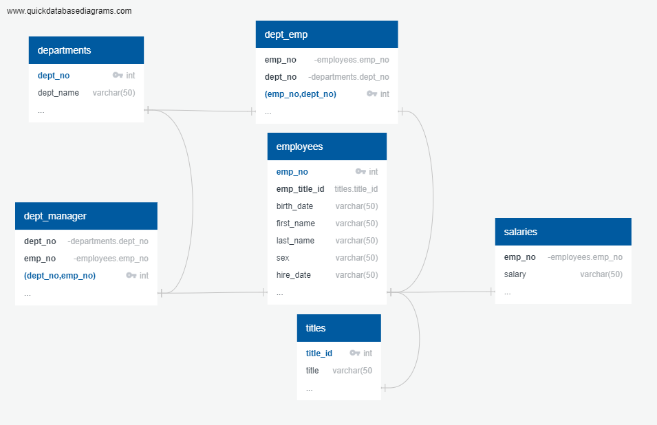

# SQL-challenge

The task involved in this exercise is a research project on employees of the corporation from the 1980s and 1990s. The source of information of the employees from that period is the siz CSV files.

The activity involved designing the table to hold the data in the CSVs into a SQL database to perform Data Engineering and Data Analysis. 

#### Data Modeling

The CSV files were inspected and the ERD diagram was created using the quickdatabasediagrams tool. The ERD created is as shown below:

#### Data Engineering

The database was then created and the queries were build to extract the following:
- List of employee number, last name, first name, sex, and salary for each employee.
- List of first name, last name, and hire date for employees who were hired in 1986.
- List of the manager of each department with the following information: department number, department name, the manager's employee number, last name, first name.
- List of List the department of each employee with the following information: employee number, last name, first name, and department name.
- List of first name, last name, and sex for employees whose first name is "Hercules" and last names begin with "B."
- List of all employees in the Sales department, including their employee number, last name, first name, and department name.
- List of all employees in the Sales and Development departments, including their employee number, last name, first name, and department name.
-  List of the frequency count of employee last names, i.e., how many employees share each last name, in descending order.

Lastly, SQLAlchemy was implemented to connect to the database, to analyse the data in a dataframe using pandas. A histogram was created to visualize the most common salary ranges for the employees as shown below:

A bar chart was created using the avaialble data to show the average salary by title.

### Conclusion: The most common salary range for employees is between 40000 to 50000.